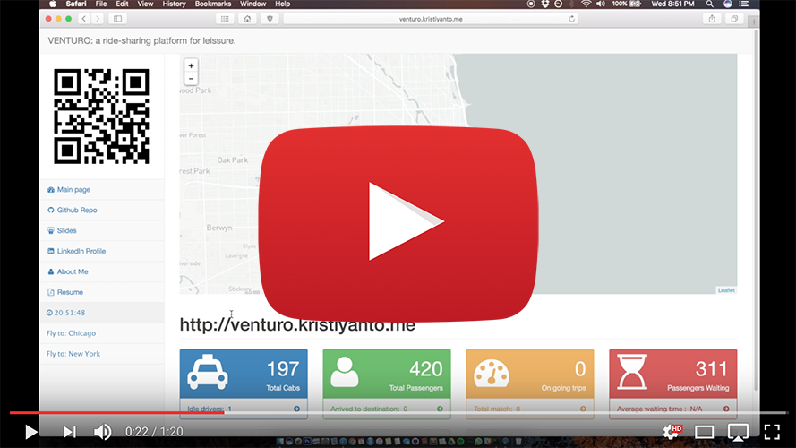
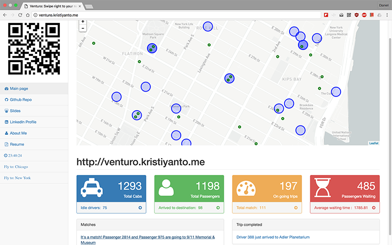
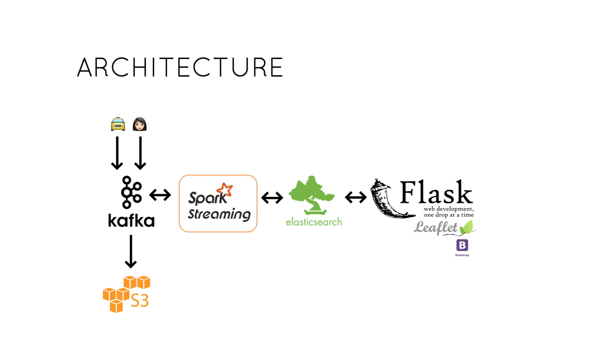
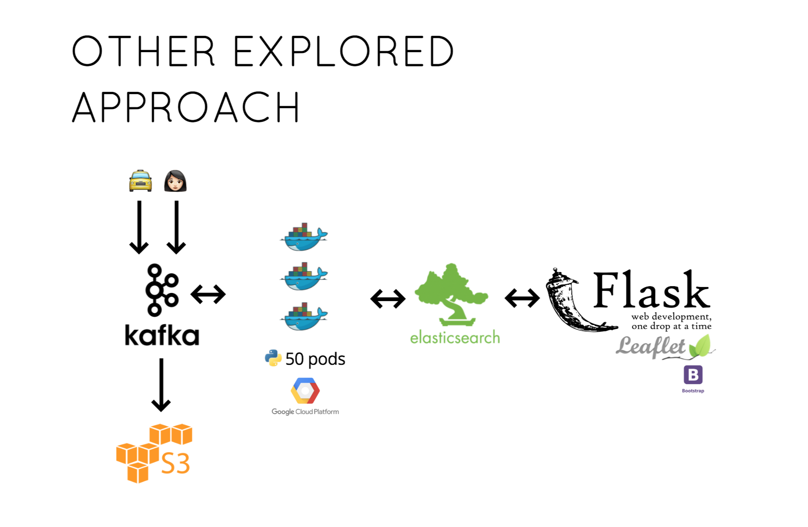

# VENTURO: an Insight data science project
*Swipe right to your next adventurous ride*

Venturo is a ridesharing platform with common destinations, e.g. to complement city passes. Users select multiple destinations and matched with a driver and other users. Currently serving 2 cities: Chicago and New York City.

## Demo
Demo available at: http://venturo.kristiyanto.me

Video Demo:

## Data
The platform takes 2 data stream, both in JSON format:

1.  From passenger : {id, current location, status, destinations ..}

2.  From the driver: {id, current location, status, destination, passenger, ..}

[Click here for the complete schema](elasticsearch). The data is generated by placing both drivers and passenger on a map and simulate a moving location toward destinations within 1-2 hops (euclidean).

## Matching
The matching is heuristic and driver-centric:

1. If a driver available / idle, scan for passenger nearby.
2. Dispatch to pick up the passenger.
3. Switch status to 'On trip' to the destination. Along the way, unless cab is full, driver continuously scan another passenger nearby with common destinations, and re-route if necessary.
4. Once arrived, drivers' status are set back to idle to pick up other passengers. Passengers removed after 2 hours later.

## Dashboard and Queries
The dashboard put the drivers and passengers on the map in real-time fashion within 1-hour window. Since the data is simulated, some passengers and drivers may appear in unlikely places (e.g. river/lake).

Green dots represent passengers, Blue represents drivers. Green inside blue represents passenger(s) on a trip.
The stats:
- Total cabs: total active drivers (including idle, on trip, and dispatched drivers)
- Idle driver: cabs without passenger
- Total passenger: total passengers (including passengers on trip, waiting for passenger, or passengers being pickup, etc)
- On going trips: total cabs with passengers on going to destination
- Passenger waiting: total passengers not assigned to any drivers
- Average waiting time: in seconds, the average time between waiting for passengers to the time passengers hop on into the car.

Other queries that performed internally:
- Check nearby passengers for driver assigments
- Current location to perform simulation (called by Kafka Producer)

## Architecture

__Ingestion layer__

Data streams for passengers and drivers generated separately in python (Kafka producers) and ingested in Kafka as different topics. Kafka is set with 4 hours retention policy.

[Secor](https://github.com/pinterest/secor) is used to saving all raw streams into Amazon S3 for later purposes (batch, re-play, forensics, or analytics).

__Stream processing__

Recieved JSON streams are processed and transformed in Spark Streaming with window 3 seconds, consuming data streams from both drivers and passengers. Every incoming message is subject to sanity check: e.g. driver's reported status is matched with the previous status, etc. to anticipate latency.

__Sink__

Elasticsearch is used as the buffer/transactional interface for the resulted messages. Elasticsearch is also called by Spark to enable assignments. Elasticsearch geo-location and boolean queries are leveraged. 

__Output__

The output is served as API by using Flask, output intended  mainly for dashboard and sent back to passanger and drivers.
For Dashboard: Bootstrap2, jquery, and leaflet are used to prettify the output.

# Infrastructure
Hosted in Amazon S3 with 3 m3.large instances for Spark Processing and 4 m3. medium instances for other services (multitenant).

# Performance
The platform was tested to handle 3,000 active drivers and 5,000 passangers in a continues datastream on the forementioned infrastructure. 

# Docker Approach

An alternate approach was also evaluated and performed by containerizing Kafka Consumer and run it on Google Contaniner on Google Cloud Platform. 

# About
An Insight Data Science project by Daniel Kristiyanto.

Palo Alto, California -- Autumn, 2016.
