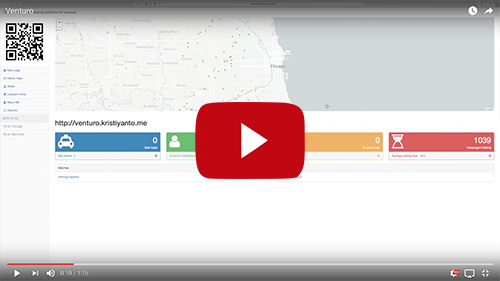

# venturo
"Swipe right to your next adventurous ride"

Venturo is a ridesharing platform with common destinations, e.g. to complement city passes. Users select multiple destinations; and matched with a driver and other users. Currently serving 2 cities: Chicago and New York City.

## Demo
Demo available at:
[Demo Video](https://youtu.be/GpJAtzlqFNk)

## Data
The plaform takes 2 data stream, both in JSON format:

1. 🙋 From passenger : {id, current location, status, destinations ..}

2. 🚕 From the driver: {id, current location, status, destination, passenger, ..}

click here for a complete schema. The data is generated by placing both drivers and passenger on a map, and simulate a moving location toward destinations within 1-2 hops (euclidian).

## Matching
The matching is heuristic, and driver-centric: 
1) if a driver available / idle, scan for passenger nearby 
2) Dispatch 
3) On trip to next destination. Along the way, unless cab is full, driver continuously scan other passenger nearby with common destinations, and re-route if necesary.
4) Once arrived, drivers's status are set back to idle to pick up other passengers. Passengers removed after 2 hours later.

## Dashboard and Queries
The dashboard put the drivers and passengers on the map in realtime fashion within 1 hour window. Since the data is simulated, some passengers and drivers may appear on unlikely places (e.g. river/lake).

Green dots represent passengers, Blue represents drivers. Green inside blue represents passenger(s) on a trip.
The stats:
- Total cabs: total active drivers (including idle, on trip, and dispatched drivers)
- Idle driver: cabs without pasenger
- Total passenger: total passengers (including passengers on trip, waiting passenger, or passengers being pickup, etc)
- On going trips: total cabs with passengers on going to destination
- Passenger waiting: total passengers not assigned to any drivers
- Average waiting time: in seconds, average time between waiting passengers to the time passengers hop on into the car.

Other queries that performed internally:
- Check nearby passangers

## Architecture
__Ingestion layer__
Data streams for passengers and drivers generated separately in python (kafka producers), and ingested in Kafka as different topics. Kafka is set with 4 hours retention policy.

Secor is used to save all raw streams into Amazon S3 for later purposes (batch, re-play, forensics, or analytics).

__Stream processing__
Stream processing is performed in Spark Streaming with window 3 seconds, consuming data streams from both drivers and passangers. Every incoming messages are subject of sanity check: e.g. driver's reported status is matched with previous status, etc. to anticipate latency.

__Sink__
Elasticsearch is used as the buffer/transactional interface for the resulted messages. Elasticsearch is also called by Spark to enable assigments. Elasticsearch geo location and boolean queries are leveraged. 

__Output__
Output is served as API by using Flask. Bootstrap2, jquery and leaflet is used to prettify the output.

# Contact
An Insight Data Science project by Daniel Kristiyanto.
Palo Alto, California -- Autumn, 2016.
